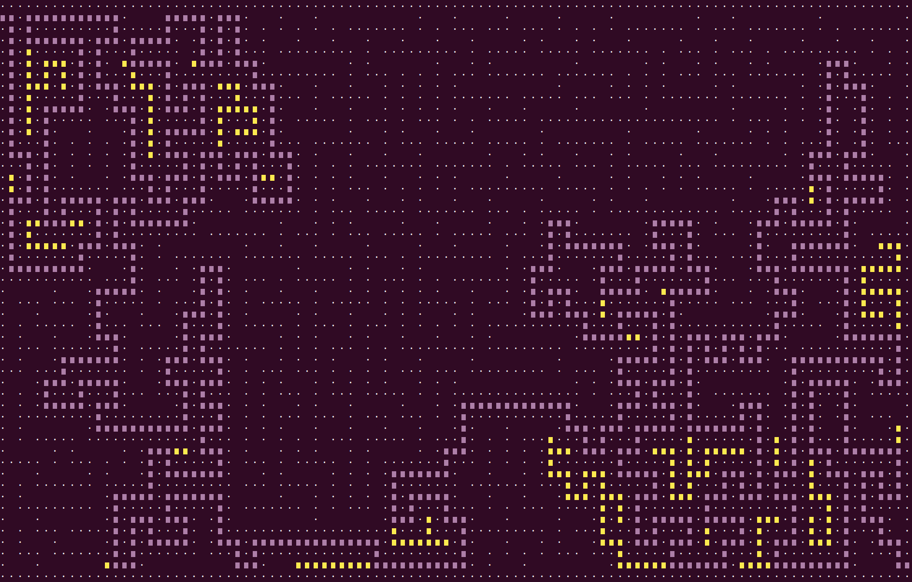
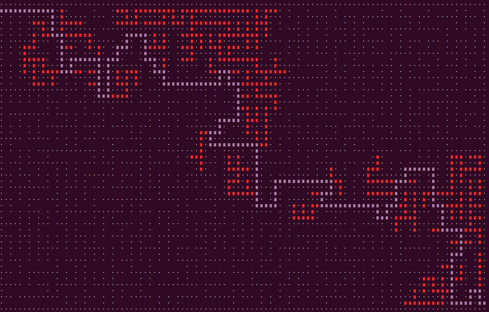
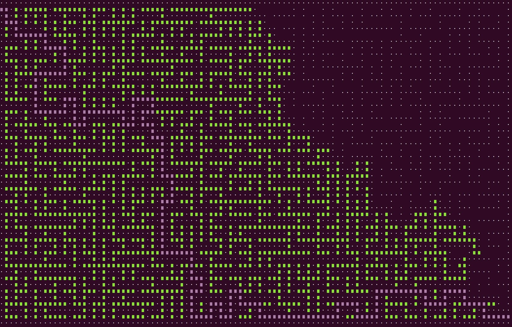
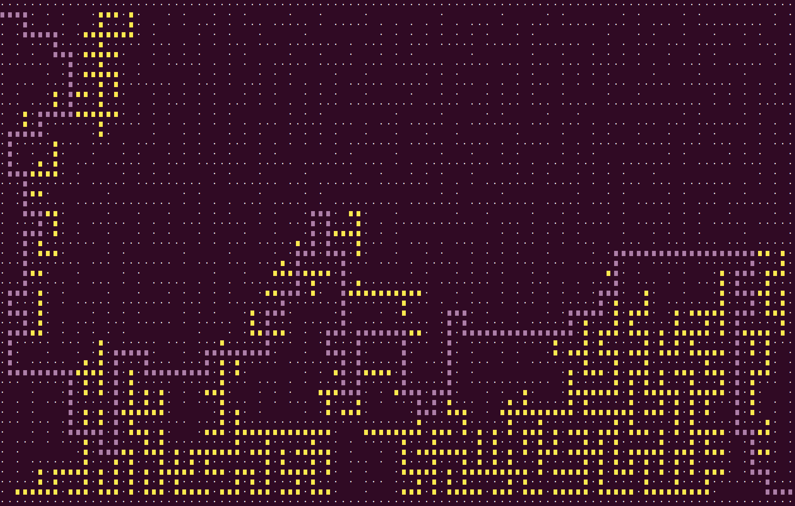
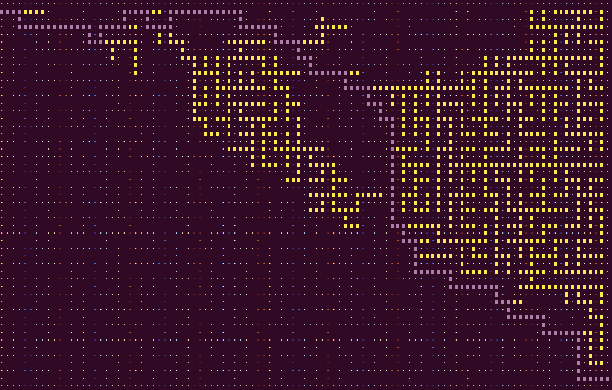

# aMaze

These are some experiments with maze generators and solvers.

See https://en.wikipedia.org/wiki/Maze_generation_algorithm

Generators:

- DFS
- Kruskal
- Prim

Solvers:

- DFS
- BFS
- OPT, heuristic based BFS

DFS generator tends to produce more convoluted mazes than Kruskal or
Prim.

